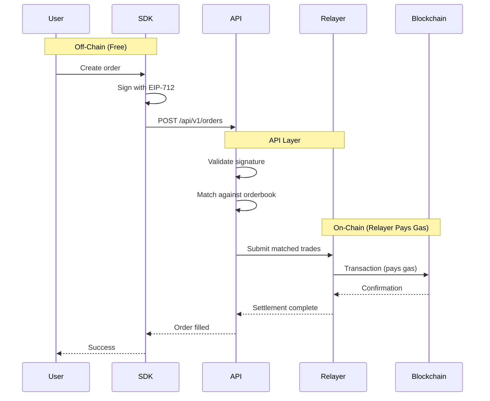
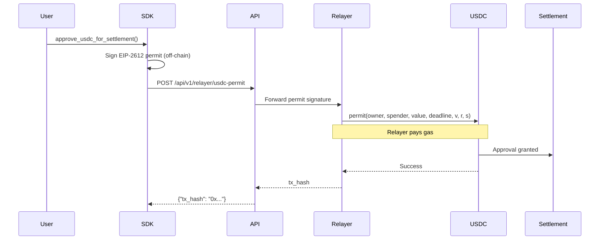
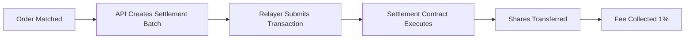

# Gasless Trading

One of Turbine's core innovations is **fully gasless trading**. You never need to hold ETH, MATIC, AVAX, or any native blockchain token. All you need is **USDC** in your wallet.

## Why Gasless Matters

### Traditional DeFi Friction

On most decentralized platforms:

1. **Multiple tokens required:**
   - USDC for trading
   - ETH/MATIC/AVAX for gas fees

2. **Gas management complexity:**
   - Monitor native token balance
   - Bridge gas tokens from exchanges
   - Calculate gas prices and limits
   - Handle failed transactions due to insufficient gas

3. **Cost unpredictability:**
   - Gas prices fluctuate
   - Failed transactions still cost gas
   - Small trades become uneconomical

### Turbine's Solution

Turbine eliminates all of this:

- **One token:** Only USDC needed
- **Fixed costs:** 1% flat fee per trade, nothing else
- **No failed gas:** Transactions submitted by relayer, not you
- **Accessible:** Newcomers don't need to understand gas

```python
# Traditional DeFi (Uniswap example)
balance_usdc = check_usdc_balance()      # Have USDC ✓
balance_eth = check_eth_balance()        # Need ETH for gas ✗
if balance_eth < estimate_gas_cost():
    bridge_eth_from_exchange()            # Extra step

# Turbine
balance_usdc = client.get_usdc_balance() # Have USDC ✓
# That's it. No gas tokens needed.
```

## How It Works: API-Routed Architecture

Turbine is **fully API-routed** — all operations go through `api.turbinefi.com`, which handles on-chain submission via a relayer.



### Key Principles

1. **No Direct RPC Calls**
   - SDK never connects to a blockchain node
   - No web3 provider required
   - No RPC URLs, no wallet connectors

2. **Signatures, Not Transactions**
   - Users sign messages (off-chain, free)
   - Relayer submits transactions (on-chain, pays gas)

3. **API-Mediated Settlement**
   - Turbine's API coordinates all on-chain actions
   - Batches multiple operations for efficiency
   - Guarantees gas cost coverage

## Gasless Operations

Every operation that would normally require gas is handled through the API:

### 1. USDC Approval

Before trading, the settlement contract needs permission to spend your USDC. On traditional platforms, this requires sending an on-chain transaction and paying gas.

Turbine uses **EIP-2612 permits** (gasless approvals):

```python
# Check current allowance
allowance = client.get_usdc_allowance()
print(f"Current allowance: ${allowance / 1e6:.2f}")

if allowance == 0:
    # Gasless approval via permit
    result = client.approve_usdc_for_settlement()
    print(f"Approval submitted: {result['tx_hash']}")
    # Relayer pays gas ✓
```

#### How USDC Permits Work



**Implementation from `client.py`:**

```python
def approve_usdc_for_settlement(self, settlement_address=None):
    """Approve USDC spending using gasless permit."""
    from eth_account import Account
    
    MAX_UINT256 = 2**256 - 1
    
    owner = self._signer.address
    spender = settlement_address or self._chain_config.settlement_address
    usdc_address = self._chain_config.usdc_address
    
    # Get nonce from API (no RPC needed)
    nonce = self._get_contract_nonce(owner, usdc_address)
    
    # Build EIP-2612 permit message
    typed_data = {
        "types": {
            "EIP712Domain": [...],
            "Permit": [
                {"name": "owner", "type": "address"},
                {"name": "spender", "type": "address"},
                {"name": "value", "type": "uint256"},
                {"name": "nonce", "type": "uint256"},
                {"name": "deadline", "type": "uint256"},
            ],
        },
        "domain": {
            "name": "USD Coin",
            "version": "2",
            "chainId": self._chain_id,
            "verifyingContract": usdc_address,
        },
        "message": {
            "owner": owner,
            "spender": spender,
            "value": MAX_UINT256,  # Max approval
            "nonce": nonce,
            "deadline": MAX_UINT256,  # Never expires
            
        },
    }
    
    # Sign off-chain (free)
    signed = Account.sign_typed_data(self._signer._account.key, typed_data)
    
    # Submit to relayer (relayer pays gas)
    return self.request_usdc_permit(
        owner=owner,
        spender=spender,
        value=MAX_UINT256,
        deadline=MAX_UINT256,
        v=signed.v,
        r=hex(signed.r),
        s=hex(signed.s),
    )
```

<Info>
USDA approval is a **one-time operation** per chain. Once approved, all future trades reuse the same allowance. The SDK automatically checks if approval is needed.
</Info>

### 2. Order Settlement

When orders match, the trade must be settled on-chain. The relayer handles this:

```python
# Submit order (you sign, relayer settles)
order = client.create_limit_buy(
    market_id=market.market_id,
    outcome=Outcome.YES,
    price=500000,
    size=10_000_000,
)

result = client.post_order(order)
# API matches order and relayer settles on-chain
# You pay: 1% fee + order cost
# Relayer pays: Gas fees
```

**Settlement flow:**



You only pay the **1% trading fee**. Gas is covered by the relayer.

### 3. Claiming Winnings

After a market resolves, you redeem winning shares for USDC. Again, gasless:

```python
# Check for claimable positions
claimable = client.get_claimable_positions()

for position in claimable['claimable']:
    print(f"Market: {position.market_id}")
    print(f"Payout: ${position.payout}")

# Claim from single market (gasless)
tx = client.claim_winnings(market.contract_address)
print(f"Claim transaction: {tx['tx_hash']}")

# Or batch claim from multiple markets
tx = client.batch_claim_winnings([
    market1.contract_address,
    market2.contract_address,
])
```

**Claiming process from `client.py`:**

```python
def claim_winnings(self, market_contract_address):
    """Claim winnings using gasless permit."""
    owner = self._signer.address
    
    # Fetch claim data from API (no RPC)
    response = self._http.get(
        f"/api/v1/users/{owner}/claim-data",
        params={"chain_id": self._chain_id, "markets": market_contract_address}
    )
    
    m = response["markets"][0]
    
    # Sign redemption permit (off-chain)
    typed_data = {
        "types": {...},
        "domain": {
            "name": "ConditionalTokensWithPermit",
            "verifyingContract": m["ctf_address"],
            ...
        },
        "message": {
            "owner": owner,
            "collateralToken": m["collateral_token"],
            "conditionId": m["condition_id"],
            "indexSets": [1 if m["winning_outcome"] == 0 else 2],
            ...
        },
    }
    
    signed = Account.sign_typed_data(self._signer._account.key, typed_data)
    
    # Submit to relayer (relayer pays gas)
    return self.request_ctf_redemption(...)
```

### 4. Balance & Allowance Checks

Even read-only operations are API-routed:

```python
# Check USDC balance (via API, not RPC)
balance = client.get_usdc_balance()
print(f"Balance: ${balance / 1e6:.2f} USDC")

# Check allowance (via API, not RPC)
allowance = client.get_usdc_allowance()
print(f"Allowance: ${allowance / 1e6:.2f}")

# Both use GET /api/v1/users/{address}/balances
# API queries blockchain and returns result
# No web3 provider needed in SDK
```

## Contract Nonces via API

For permit signatures (USDC approval, CTF redemption), you need the current nonce from the contract. Turbine's API provides this:

```python
# From client.py
def _get_contract_nonce(self, owner, contract_address):
    """Get nonce from contract via API (no RPC)."""
    endpoint = f"/api/v1/contracts/nonce/{contract_address}/{owner}"
    response = self._http.get(endpoint, params={"chain_id": self._chain_id})
    return int(response.get("nonce", 0))
```

**API endpoint:**
```
GET /api/v1/contracts/nonce/{contract}/{owner}?chain_id=137
```

**Response:**
```json
{
  "nonce": 0,
  "contract": "0x3c499c542cEF5E3811e1192ce70d8cC03d5c3359",
  "owner": "0x742d35Cc6634C0532925a3b844Bc9e7595f0bEb",
  "chain_id": 137
}
```

This ensures all permit signatures use correct nonces without requiring RPC access.

## Supported Chains

Gasless trading works on all Turbine-supported chains:

| Chain | Chain ID | Settlement Contract | USDC Address |
|-------|----------|---------------------|-------------|
| **Polygon** | 137 | `0xdB96C91d9e5930fE3Ed1604603CfA4ece454725c` | `0x3c499c542cEF5E3811e1192ce70d8cC03d5c3359` |
| **Avalanche** | 43114 | `0x893ca652525B1F9DC25189ED9c3AD0543ACfb989` | `0xB97EF9Ef8734C71904D8002F8b6Bc66Dd9c48a6E` |
| **Base Sepolia** | 84532 | `0xF37B881F236033E55bF1cdAB628c7Cd88aAd89D4` | `0xf9065CCFF7025649F16D547DC341DAffF0C7F7f6` |

<Note>
Polygon is the recommended mainnet. Base Sepolia is a testnet (currently non-operational).
</Note>

## Cost Breakdown

### What You Pay

| Operation | Cost | When |
|-----------|------|------|
| **Trading fee** | 1% of trade value | Per trade (matched orders) |
| **USDC transfer** | Cost of shares | When buying shares |
| **Order creation** | Free | Signing is off-chain |
| **Order cancellation** | Free | API operation |
| **Balance checks** | Free | Read-only |

### What Turbine Pays (Relayer)

| Operation | Gas Cost | Who Pays |
|-----------|----------|----------|
| **USDC permit** | ~50,000 gas | Relayer |
| **Trade settlement** | ~150,000 gas per trade | Relayer |
| **CTF redemption** | ~100,000 gas | Relayer |

At current Polygon gas prices (~30 gwei), a trade costs the relayer ~$0.01-0.02 in gas. You pay nothing.

### Example Cost Comparison

**Scenario:** Buy 10 YES shares at $0.60, then claim winnings after market resolves.

| Platform | Your Costs | Notes |
|----------|------------|-------|
| **Traditional DeFi** | $6.00 (shares) + $0.50 (approval gas) + $0.80 (trade gas) + $0.40 (claim gas) = **$7.70** | Must hold MATIC for gas |
| **Turbine** | $6.00 (shares) + $0.06 (1% fee) = **$6.06** | Only USDC needed |

**Savings:** $1.64 (21% cheaper) + no need to manage gas tokens.

## Security Model

### Trust Assumptions

Gasless trading introduces a relayer dependency:

**What the relayer can't do:**
- ✗ Steal your USDC (you sign permits, not transfers)
- ✗ Create orders on your behalf (orders are EIP-712 signed by you)
- ✗ Change order terms (signature verification fails)

**What the relayer can do:**
- ✓ Delay or refuse to submit transactions
- ✓ Censor specific users or orders
- ✓ Go offline (halts trading)

**Mitigation:**
- Turbine's relayer is operated by the Ojo team (trusted entity)
- Future: Decentralized relayer network planned
- Fallback: You can always submit permits directly on-chain (requires gas)

### Permit Signature Safety

Permits use EIP-712 typed signatures with:

1. **Deadline:** Prevents old permits from being replayed
   ```python
   deadline = int(time.time()) + 3600  # 1 hour
   ```

2. **Nonce:** Ensures one-time use
   ```python
   nonce = client._get_contract_nonce(owner, usdc_address)
   ```

3. **Domain separation:** Locked to specific chain and contract
   ```python
   domain = {
       "chainId": 137,
       "verifyingContract": "0x3c499c542cEF5E3811e1192ce70d8cC03d5c3359",
   }
   ```

These protections make permit signatures as secure as direct on-chain transactions.

## Implementation Examples

### Complete Gasless Workflow

```python
import os
from turbine_client import TurbineClient, Outcome

# Initialize client (no RPC URL needed)
client = TurbineClient(
    host="https://api.turbinefi.com",
    chain_id=137,  # Polygon
    private_key=os.getenv("TURBINE_PRIVATE_KEY"),
    api_key_id=os.getenv("TURBINE_API_KEY_ID"),
    api_private_key=os.getenv("TURBINE_API_PRIVATE_KEY"),
)

print(f"Trading as: {client.address}")

# 1. Check USDC balance (API call, no RPC)
balance = client.get_usdc_balance()
print(f"USDC Balance: ${balance / 1e6:.2f}")

if balance < 10_000_000:  # Less than $10
    print("Insufficient USDC. Deposit to your wallet.")
    exit()

# 2. Check allowance (API call, no RPC)
allowance = client.get_usdc_allowance()
print(f"Current Allowance: ${allowance / 1e6:.2f}")

if allowance == 0:
    # 3. Gasless USDC approval
    print("Approving USDC for trading (gasless)...")
    result = client.approve_usdc_for_settlement()
    print(f"Approval tx: {result['tx_hash']}")
    print("Waiting for confirmation...")
    time.sleep(10)

# 4. Get current market
market = client.get_quick_market("BTC")
print(f"Market: {market.question}")
print(f"Strike: ${market.start_price / 1e6:,.2f}")

# 5. Place order (signed off-chain, settled by relayer)
order = client.create_limit_buy(
    market_id=market.market_id,
    outcome=Outcome.YES,
    price=500000,  # $0.50
    size=10_000_000,  # 10 shares
)

result = client.post_order(order)
print(f"Order submitted: {result['orderHash']}")
print("Relayer will settle on-chain (you pay 1% fee, no gas)")

# 6. Wait for market to resolve
print("Waiting for market to resolve...")
while True:
    resolution = client.get_resolution(market.market_id)
    if resolution.resolved:
        print(f"Market resolved: {'YES' if resolution.outcome == 0 else 'NO'} wins")
        break
    time.sleep(30)

# 7. Claim winnings (gasless)
claimable = client.get_claimable_positions()
if claimable['count'] > 0:
    for position in claimable['claimable']:
        print(f"Claiming ${position.payout} from {position.market_id[:10]}...")
        tx = client.claim_winnings(position.contract_address)
        print(f"Claim tx: {tx['tx_hash']}")
else:
    print("No winnings to claim.")

print("All operations completed gaslessly!")
```

### Handling USDC Approval in Bots

```python
def ensure_usdc_approved(client):
    """Ensure USDC is approved for trading (gasless).
    
    Only needs to run once per wallet per chain.
    """
    allowance = client.get_usdc_allowance()
    
    if allowance > 0:
        print(f"USDC already approved: ${allowance / 1e6:.2f}")
        return
    
    print("Approving USDC (one-time gasless operation)...")
    result = client.approve_usdc_for_settlement()
    print(f"Approval tx: {result['tx_hash']}")
    print("Waiting 15 seconds for confirmation...")
    time.sleep(15)
    
    # Verify
    new_allowance = client.get_usdc_allowance()
    if new_allowance > 0:
        print(f"✓ Approved: ${new_allowance / 1e6:.2f}")
    else:
        raise Exception("Approval failed")

# Run once at bot startup
ensure_usdc_approved(client)

# Now trade freely
while True:
    market = client.get_quick_market("BTC")
    order = client.create_limit_buy(...)
    client.post_order(order)  # No gas needed
```

## Benefits Summary

| Traditional DeFi | Turbine (Gasless) |
|------------------|------------------|
| Need USDC + ETH/MATIC | Only USDC |
| Manage gas prices | Fixed 1% fee |
| Failed txs cost gas | No failed gas costs |
| RPC endpoints required | API-only |
| Web3 wallet needed | Private key only |
| 3-5 token approvals | 1 gasless permit |
| High barrier to entry | Beginner-friendly |

**Result:** Faster onboarding, lower costs, simpler UX.

## Next Steps

- [API Reference](/api/turbine-client) - Complete SDK documentation
- [Building a Bot](/guides/building-bots) - Create your first trading bot
- [Prediction Markets](/concepts/prediction-markets) - Understand market mechanics