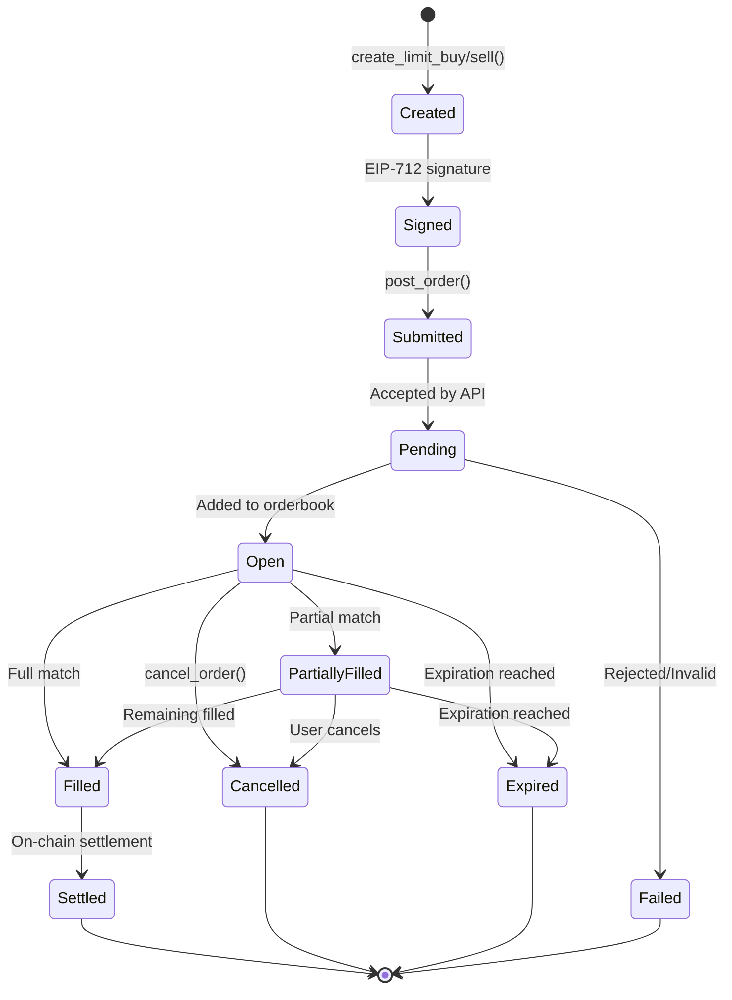

# Order Types

Turbine operates a **Central Limit Order Book (CLOB)** with **limit orders** as the primary order type. Unlike AMMs (Automated Market Makers) where you trade against a liquidity pool, on Turbine you trade against other users' resting orders.

## Limit Orders

A **limit order** specifies the exact price and size you're willing to trade at. The order sits in the orderbook until:
1. It's matched with a counter-order (filled)
2. You cancel it
3. It expires

### Buy vs. Sell Orders

```python
from turbine_client import TurbineClient, Outcome, Side
import time

client = TurbineClient(
    host="https://api.turbinefi.com",
    chain_id=137,
    private_key="0x...",
    api_key_id="...",
    api_private_key="0x...",
)

market = client.get_quick_market("BTC")

# Limit BUY order: willing to pay up to $0.55 for YES shares
buy_order = client.create_limit_buy(
    market_id=market.market_id,
    outcome=Outcome.YES,
    price=550000,      # $0.55 (scaled by 1e6)
    size=10_000_000,   # 10 shares (6 decimals)
    expiration=int(time.time()) + 900,  # 15 minutes
)

# Limit SELL order: willing to sell YES shares for at least $0.60
sell_order = client.create_limit_sell(
    market_id=market.market_id,
    outcome=Outcome.YES,
    price=600000,      # $0.60
    size=5_000_000,    # 5 shares
    expiration=int(time.time()) + 900,
)

client.post_order(buy_order)
client.post_order(sell_order)
```

### Order Parameters

| Parameter | Type | Description | Example |
|-----------|------|-------------|---------|
| `market_id` | `str` | Market identifier (hex) | `"0x8f3a2c1b..."` |
| `side` | `Side` | `Side.BUY` or `Side.SELL` | `Side.BUY` |
| `outcome` | `Outcome` | `Outcome.YES` or `Outcome.NO` | `Outcome.YES` |
| `price` | `int` | Price scaled by 1e6 (1-999,999) | `500000` = $0.50 |
| `size` | `int` | Size with 6 decimals | `1_000_000` = 1 share |
| `expiration` | `int` | Unix timestamp | `1709654400` |
| `nonce` | `int` | Unique ID (auto-generated) | `1709654400123456` |
| `maker_fee_recipient` | `str` | Fee recipient address | `"0x..."` |

<Note>
All orders are **limit orders**. There are no market orders (immediate execution at any price). To simulate a market order, set your limit price very aggressively (e.g., buy at 999,999 or sell at 1).
</Note>

## Price Representation

### Price Scaling

Prices are represented as **integers scaled by 1,000,000 (1e6)**:

```python
# Human-readable → SDK format
def to_price(dollars: float) -> int:
    """Convert dollar price to SDK format.
    
    Args:
        dollars: Price in dollars (0.01 to 0.99)
        
    Returns:
        Integer price scaled by 1e6
    """
    return int(dollars * 1_000_000)

# SDK format → Human-readable  
def from_price(price: int) -> float:
    """Convert SDK price to dollars.
    
    Args:
        price: Integer price (1 to 999,999)
        
    Returns:
        Price in dollars
    """
    return price / 1_000_000

# Examples
print(to_price(0.50))    # 500000 (50%)
print(to_price(0.75))    # 750000 (75%)
print(from_price(250000)) # 0.25 ($0.25)
```

### Valid Price Range

Prices must be between **1 and 999,999** (inclusive):

- **Minimum:** 1 = $0.000001 (0.0001%)
- **Maximum:** 999,999 = $0.999999 (99.9999%)
- **Not allowed:** 0 or 1,000,000 (these would be risk-free)

```python
from turbine_client.exceptions import OrderValidationError

try:
    order = client.create_limit_buy(
        market_id=market.market_id,
        outcome=Outcome.YES,
        price=0,  # ✗ Invalid
        size=1_000_000,
    )
except OrderValidationError as e:
    print(f"Invalid price: {e}")
    # Output: Price must be between 1 and 999999, got 0
```

### Implied Probability

Price reflects the market's belief about the outcome's probability:

```python
def implied_probability(price: int) -> float:
    """Calculate implied probability from price.
    
    Args:
        price: Integer price (1 to 999,999)
        
    Returns:
        Probability as percentage (0-100)
    """
    return (price / 1_000_000) * 100

# Examples
print(f"{implied_probability(500000):.1f}%")  # 50.0%
print(f"{implied_probability(750000):.1f}%")  # 75.0%
print(f"{implied_probability(900000):.1f}%")  # 90.0%
```

## Size Representation

### Share Decimals

Sizes are represented as **integers with 6 decimals**:

```python
# Human-readable → SDK format
def to_size(shares: float) -> int:
    """Convert share count to SDK format.
    
    Args:
        shares: Number of shares (e.g., 10.5)
        
    Returns:
        Integer size with 6 decimals
    """
    return int(shares * 1_000_000)

# SDK format → Human-readable
def from_size(size: int) -> float:
    """Convert SDK size to shares.
    
    Args:
        size: Integer size (6 decimals)
        
    Returns:
        Number of shares
    """
    return size / 1_000_000

# Examples
print(to_size(1))      # 1,000,000 (1 share)
print(to_size(10))     # 10,000,000 (10 shares)
print(to_size(0.5))    # 500,000 (0.5 shares)
print(from_size(2_500_000))  # 2.5 shares
```

### Calculating Order Cost

The cost of a **BUY order** is:

```python
def order_cost(price: int, size: int) -> float:
    """Calculate the cost of a buy order in USDC.
    
    Args:
        price: Integer price (scaled by 1e6)
        size: Integer size (6 decimals)
        
    Returns:
        Cost in USDC dollars
    """
    return (price / 1_000_000) * (size / 1_000_000)

# Example: Buy 10 YES shares at $0.60 each
price = 600000  # $0.60
size = 10_000_000  # 10 shares
cost = order_cost(price, size)
print(f"Cost: ${cost:.2f} USDC")  # Cost: $6.00 USDC
```

<Warning>
**Taker orders** (orders that immediately fill against resting orders) must have a total cost of at least **$1.00 USDC**:

```python
if order_cost(price, size) < 1.0:
    raise ValueError("Taker orders must be >= $1.00 USDC")
```

**Maker orders** (resting limit orders) have no minimum. This limit is enforced by the API, not the SDK.
</Warning>

## Order Lifecycle

Every order goes through a well-defined lifecycle:



### 1. Creation

Create the order parameters:

```python
from turbine_client.types import OrderArgs, Side, Outcome
import time

order_args = OrderArgs(
    market_id=market.market_id,
    side=Side.BUY,
    outcome=Outcome.YES,
    price=500000,
    size=10_000_000,
    expiration=int(time.time()) + 900,  # 15 minutes
)
```

### 2. Signing

Sign with EIP-712:

```python
# Automatic via create_limit_buy
order = client.create_limit_buy(
    market_id=market.market_id,
    outcome=Outcome.YES,
    price=500000,
    size=10_000_000,
)

print(f"Order hash: {order.order_hash}")
print(f"Signature: {order.signature}")
```

### 3. Submission

Submit to the API:

```python
result = client.post_order(order)
print(f"Order submitted: {result['orderHash']}")
# Output: Order submitted: 0x8f3a2c1b4d5e6f7a8b9c0d1e2f3a4b5c...
```

### 4. Matching & Execution

The API's matching engine:
1. **Validates** the order (signature, balance, price/size)
2. **Matches** against resting orders (if available)
3. **Settles** matched trades on-chain
4. **Adds** remaining size to orderbook (if not fully filled)

### 5. Verification

After submitting, verify the order's status:

```python
import time

def verify_order_status(client, order_hash, market_id, trader):
    """Verify an order's status using multiple checks.
    
    This implements the order verification chain from price_action_bot.py.
    """
    # Wait for settlement
    time.sleep(2)
    
    # 1. Check failed trades
    failed = client.get_failed_trades()
    for trade in failed:
        if trade.buyer_address == trader or trade.seller_address == trader:
            if trade.market_id == market_id:
                return "failed", f"Trade failed: {trade.reason}"
    
    # 2. Check pending trades
    pending = client.get_pending_trades()
    for trade in pending:
        if trade.buyer_address == trader or trade.seller_address == trader:
            if trade.market_id == market_id:
                return "pending", "Trade settling on-chain..."
    
    # 3. Check recent trades (filled)
    trades = client.get_trades(market_id, limit=50)
    for trade in trades:
        if trade.buyer == trader or trade.seller == trader:
            return "filled", f"Filled at {trade.price / 1e6:.2f}"
    
    # 4. Check open orders (resting in orderbook)
    orders = client.get_orders(trader=trader, market_id=market_id)
    for o in orders:
        if o.order_hash == order_hash:
            if o.filled_size > 0:
                return "partially_filled", f"Filled {o.filled_size / 1e6:.2f} shares"
            return "open", "Resting in orderbook"
    
    return "unknown", "Order not found"

status, msg = verify_order_status(client, order.order_hash, market.market_id, client.address)
print(f"Status: {status} - {msg}")
```

<Info>
This verification chain is critical for trading bots. It ensures you know the true state of your order and can handle failures, partial fills, and successful placements correctly.
</Info>

## Order Management

### Viewing Open Orders

```python
# All open orders for your wallet
orders = client.get_orders(trader=client.address)

for order in orders:
    print(f"Order: {order.order_hash[:10]}...")
    print(f"  Market: {order.market_id[:10]}...")
    print(f"  Side: {'BUY' if order.side == 0 else 'SELL'}")
    print(f"  Outcome: {'YES' if order.outcome == 0 else 'NO'}")
    print(f"  Price: ${order.price / 1e6:.2f}")
    print(f"  Size: {order.size / 1e6:.2f} shares")
    print(f"  Filled: {order.filled_size / 1e6:.2f} shares")
    print(f"  Status: {order.status}")
    print()
```

### Filtering Orders

```python
# Orders for a specific market
market_orders = client.get_orders(
    trader=client.address,
    market_id=market.market_id,
)

# Only open orders
open_orders = client.get_orders(
    trader=client.address,
    status="open",
)

# Only filled orders
filled_orders = client.get_orders(
    trader=client.address,
    status="filled",
)
```

### Cancelling Orders

```python
# Cancel a specific order by hash
client.cancel_order(
    order_hash="0x8f3a2c1b...",
    market_id=market.market_id,  # Optional validation
    side=Side.BUY,               # Optional validation
)

# Cancel all orders for a market
client.cancel_market_orders(market_id=market.market_id)

# Cancel all open orders (across all markets)
open_orders = client.get_orders(trader=client.address, status="open")
for order in open_orders:
    client.cancel_order(order_hash=order.order_hash)
```

<Warning>
**Market transitions:** When a new quick market opens, always cancel all orders on the old market before placing new ones:

```python
if new_market_detected:
    client.cancel_market_orders(old_market_id)
    # Now safe to place orders on new market
```
</Warning>

## Minimum Order Sizes

Turbine enforces a **$1 minimum** for **taker orders** (orders that immediately fill):

### Why This Limit Exists

1. **Gas efficiency:** On-chain settlement costs are amortized across larger trades
2. **Spam prevention:** Prevents micro-orders from cluttering the orderbook
3. **Fair access:** Ensures relayer costs are covered

### Maker vs. Taker

| Order Type | Definition | Minimum Size |
|------------|------------|-------------|
| **Maker** | Rests in orderbook, provides liquidity | None (any size) |
| **Taker** | Immediately fills against resting order | $1.00 USDC |

```python
# Maker order (no minimum)
order = client.create_limit_buy(
    market_id=market.market_id,
    outcome=Outcome.YES,
    price=400000,  # Below market (will rest)
    size=100_000,  # 0.1 shares × $0.40 = $0.04
)
client.post_order(order)  # ✓ Accepted (maker)

# Taker order (must be >= $1)
orderbook = client.get_orderbook(market.market_id)
best_ask = orderbook.asks[0].price  # $0.60

order = client.create_limit_buy(
    market_id=market.market_id,
    outcome=Outcome.YES,
    price=best_ask,  # Match immediately (taker)
    size=100_000,    # 0.1 shares × $0.60 = $0.06
)
client.post_order(order)  # ✗ Rejected (< $1)
```

### Calculating Required Size

```python
def min_taker_size(price: int) -> int:
    """Calculate minimum size for a taker order at given price.
    
    Args:
        price: Order price (scaled by 1e6)
        
    Returns:
        Minimum size (6 decimals) to meet $1 threshold
    """
    # $1 = 1,000,000 micro-USDC (6 decimals)
    # size × (price / 1e6) >= 1
    # size >= 1e6 / price
    return int(1_000_000 / (price / 1_000_000))

# Examples
print(f"At $0.50: {min_taker_size(500000) / 1e6:.2f} shares")  # 2.00 shares
print(f"At $0.75: {min_taker_size(750000) / 1e6:.2f} shares")  # 1.33 shares  
print(f"At $0.90: {min_taker_size(900000) / 1e6:.2f} shares")  # 1.11 shares
```

## Order Expiration

### Setting Expiration

All orders must have an expiration timestamp:

```python
import time

# Expire in 15 minutes (typical for quick markets)
expiration = int(time.time()) + 900

# Expire in 1 hour (default if not specified)
expiration = int(time.time()) + 3600

# Expire when market expires
market = client.get_quick_market("BTC")
expiration = market.end_time

order = client.create_limit_buy(
    market_id=market.market_id,
    outcome=Outcome.YES,
    price=500000,
    size=10_000_000,
    expiration=expiration,
)
```

### Expired Order Behavior

- **Before expiration:** Order is active in orderbook, can be filled
- **At expiration:** Order is automatically removed, no longer fillable
- **After expiration:** Cannot be filled, but can still be cancelled for cleanup

<Warning>
For quick markets, set order expiration ≤ market expiration. Orders that extend beyond market expiration won't fill and waste orderbook space.
</Warning>

## Best Practices

### 1. Always Verify Orders

Use the verification chain after every submission:

```python
result = client.post_order(order)
time.sleep(2)  # Wait for settlement
status, msg = verify_order_status(client, order.order_hash, market.market_id, client.address)
```

### 2. Handle Market Transitions

```python
current_market_id = None

while True:
    market = client.get_quick_market("BTC")
    
    if market.market_id != current_market_id:
        # New market opened
        if current_market_id:
            client.cancel_market_orders(current_market_id)
        current_market_id = market.market_id
    
    # Place new orders...
    time.sleep(5)
```

### 3. Respect Minimum Sizes

```python
def safe_taker_order(client, market_id, outcome, price, size):
    """Create a taker order with minimum size check."""
    cost = (price / 1e6) * (size / 1e6)
    
    if cost < 1.0:
        # Adjust size to meet minimum
        min_size = min_taker_size(price)
        print(f"Size too small (${cost:.2f}), increasing to {min_size / 1e6:.2f} shares")
        size = min_size
    
    return client.create_limit_buy(
        market_id=market_id,
        outcome=outcome,
        price=price,
        size=size,
    )
```

### 4. Set Reasonable Expirations

```python
market = client.get_quick_market("BTC")
time_remaining = market.end_time - int(time.time())

if time_remaining < 60:
    print("Market expiring soon, skipping order placement")
else:
    # Set expiration to market expiration (or sooner)
    expiration = market.end_time
```

## Next Steps

- [Gasless Trading](/concepts/gasless-trading) - How Turbine eliminates gas fees
- [API Reference](/api/turbine-client) - Complete SDK documentation