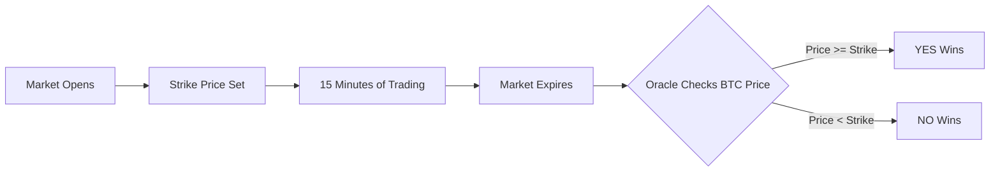

# Prediction Markets

Turbine is a decentralized prediction markets platform that lets you trade on short-term price movements. Think of it as betting on whether an asset will go up or down, but with real market dynamics and instant settlement.

## What is a Prediction Market?

A prediction market allows traders to buy and sell shares that represent different outcomes of a future event. The price of each share reflects the market's collective belief about the probability of that outcome occurring.

### How Turbine Works

Turbine specializes in **15-minute markets** for cryptocurrency prices. Every 15 minutes, a new market opens with a simple yes/no question:

**"Will BTC be above $97,250 at 3:15 PM UTC?"**

Traders buy shares representing their prediction. When the market expires, the oracle checks the actual price and determines the winner.

<Info>
Currently, Turbine only runs BTC Quick Markets (15-minute intervals). Support for other assets like ETH is built into the platform architecture but not yet live.
</Info>

## YES and NO Shares

Every prediction market has two outcomes, each represented by tradeable shares:

### YES Shares
- Pay out **$1.00** if the condition is true (BTC ends above the strike price)
- Pay out **$0.00** if the condition is false
- Priced between $0.01 and $0.99 based on market probability

### NO Shares
- Pay out **$1.00** if the condition is false (BTC ends below the strike price)  
- Pay out **$0.00** if the condition is true
- Always priced as the inverse of YES shares: `NO price = $1.00 - YES price`

### Example Trade

Let's say the current BTC quick market asks: **"Will BTC be above $97,500 at 3:00 PM?"**

- Current BTC price: $97,800 (already above the strike)
- YES shares trading at: $0.75
- NO shares trading at: $0.25

You believe BTC will stay above $97,500, so you buy 10 YES shares at $0.75 each:

```python
from turbine_client import TurbineClient, Outcome, Side

# Buy 10 YES shares at $0.75 each
order = client.create_limit_buy(
    market_id=market.market_id,
    outcome=Outcome.YES,
    price=750000,      # 75% = 0.75 (scaled by 1e6)
    size=10_000_000,   # 10 shares (6 decimals)
)

result = client.post_order(order)
```

**Cost:** 10 shares × $0.75 = $7.50 USDC

**If you're right** (BTC ends above $97,500):
- Each YES share pays $1.00
- Total payout: 10 × $1.00 = $10.00
- Profit: $10.00 - $7.50 = **$2.50** (33% return)

**If you're wrong** (BTC ends below $97,500):
- Each YES share pays $0.00  
- Total payout: $0.00
- Loss: **-$7.50** (100% loss)

## Strike Prices

The **strike price** is the threshold that determines the winner. It's set when the market opens and doesn't change.

### How Strike Prices are Set

For BTC Quick Markets, the strike price is the BTC spot price at the moment the market opens:

```python
market = client.get_quick_market("BTC")

# Strike price is stored with 6 decimals
strike_usd = market.start_price / 1_000_000
print(f"Strike: ${strike_usd:,.2f}")
# Output: Strike: $97,250.00
```

<Note>
Strike prices are always denominated in USD and use 6 decimals for precision. To convert from the raw integer value, divide by `1_000_000`.
</Note>

### Strike Price Mechanics

The strike creates a binary outcome:



- **Price >= Strike:** YES shares pay $1.00, NO shares pay $0.00
- **Price < Strike:** NO shares pay $1.00, YES shares pay $0.00

### Understanding Probability Through Price

Share prices reflect the market's belief about the probability of each outcome:

| YES Price | NO Price | Implied Probability |
|-----------|----------|--------------------|
| $0.50 | $0.50 | 50% chance either way (even odds) |
| $0.75 | $0.25 | 75% chance YES wins |
| $0.90 | $0.10 | 90% chance YES wins (strong confidence) |
| $0.10 | $0.90 | 10% chance YES wins (unlikely) |

If YES shares are trading at $0.60, the market believes there's a **60% chance** BTC will end above the strike price.

## 15-Minute Markets

Turbine's Quick Markets operate on a strict 15-minute cycle:

### Market Lifecycle

```mermaid
sequence
    participant Trader
    participant API
    participant Oracle
    participant Settlement
    
    Note over API: Market Opens (3:00 PM)
    API->>Oracle: Fetch BTC spot price
    Oracle-->>API: $97,250 (strike price)
    Note over API,Trader: 15 minutes of trading
    Trader->>API: Place orders
    API->>Settlement: Match & settle trades
    Note over API: Market Expires (3:15 PM)
    API->>Oracle: Fetch final BTC price
    Oracle-->>API: $97,380
    Note over API: YES wins (above strike)
    API->>Settlement: Resolve market
    Settlement-->>Trader: Claim winnings (gasless)
```

1. **Market Opens (0:00):** Strike price set from current BTC spot price
2. **Trading Period (0:00-14:59):** Orders can be placed, modified, cancelled
3. **Market Expires (15:00):** No new orders accepted
4. **Resolution (~15:01):** UMA oracle checks final BTC price
5. **Settlement:** Winning shares can be redeemed for $1.00 each

### Market Rotation

New markets open automatically every 15 minutes:

```python
import time

def get_time_remaining(market):
    """Calculate time until market expiration."""
    now = int(time.time())
    remaining = market.end_time - now
    return max(0, remaining)

market = client.get_quick_market("BTC")
remaining = get_time_remaining(market)
print(f"Time remaining: {remaining // 60}m {remaining % 60}s")
```

Your trading bot needs to handle market transitions automatically:

```python
def monitor_market_rotation(client):
    current_market_id = None
    
    while True:
        market = client.get_quick_market("BTC")
        
        # New market detected
        if market.market_id != current_market_id:
            print(f"New market opened: {market.question}")
            print(f"Strike: ${market.start_price / 1e6:,.2f}")
            
            # Cancel all orders on old market
            if current_market_id:
                client.cancel_market_orders(current_market_id)
            
            current_market_id = market.market_id
        
        time.sleep(5)  # Poll every 5 seconds
```

<Warning>
Stop placing new orders when less than 60 seconds remain in a market. Orders placed too close to expiration may not fill and can get stuck.
</Warning>

## Market Resolution

After a market expires, the **UMA Optimistic Oracle** determines the winner:

### Oracle Process

1. **Assertion:** After market expiration, an assertion is posted to UMA claiming the winning outcome
2. **Challenge Period:** Anyone can dispute the assertion (typically 2-5 minutes for Quick Markets)
3. **Settlement:** If unchallenged, the assertion is accepted and the market resolves

```python
# Check if a market has resolved
resolution = client.get_resolution(market_id)

if resolution.resolved:
    winning_outcome = "YES" if resolution.outcome == 0 else "NO"
    print(f"Market resolved: {winning_outcome} wins")
else:
    print("Market still resolving...")
```

<Info>
Turbine uses the **Pyth Network** oracle for BTC price data. The same price feed used for market resolution is publicly available, so your bot can trade based on the exact data source that determines winners.
</Info>

### Claiming Winnings

Once a market resolves, you can claim your winnings via Turbine's gasless relayer:

```python
# Claim from a single resolved market
tx = client.claim_winnings(market.contract_address)
print(f"Claim submitted: {tx['tx_hash']}")

# Or claim from multiple markets at once
tx = client.batch_claim_winnings([
    market1.contract_address,
    market2.contract_address,
    market3.contract_address,
])
```

Claims are processed through the API's relayer — no gas fees required.

## Key Concepts Summary

| Concept | Description |
|---------|-------------|
| **Market** | A 15-minute binary question about BTC price |
| **Strike Price** | The threshold BTC must cross for YES to win |
| **YES Shares** | Pay $1.00 if BTC ends >= strike, $0.00 otherwise |
| **NO Shares** | Pay $1.00 if BTC ends < strike, $0.00 otherwise |
| **Share Price** | Reflects market's probability (0.01 to 0.99) |
| **Resolution** | UMA oracle determines winner after expiration |
| **Settlement** | Winning shares redeemed for $1.00 each (gasless) |

## Next Steps

- [Authentication](/concepts/authentication) - Learn how to sign orders and authenticate with the API
- [Order Types](/concepts/order-types) - Understand limit orders and order lifecycle
- [Gasless Trading](/concepts/gasless-trading) - How Turbine eliminates gas fees