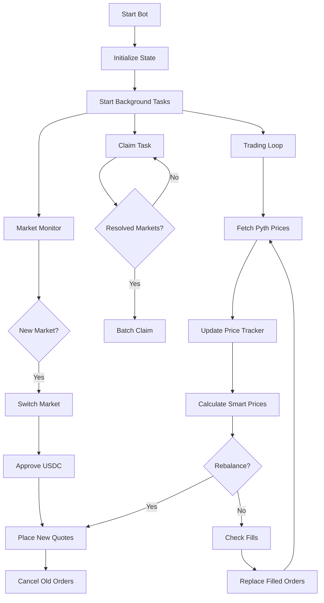

The **Market Maker Bot** is an advanced trading strategy that provides liquidity on both sides of the orderbook using a statistical probability model, momentum tracking, inventory management, and adverse selection protection.

<Warning>
  **Advanced strategy.** This bot is significantly more complex than the Price Action Bot. If you're new to Turbine, start with [Price Action](/examples/price-action-bot) first.
</Warning>

[View source on GitHub →](https://github.com/ojo-network/turbine-py-client/blob/main/examples/market_maker.py)

## What It Does

### Trading Strategy

Instead of taking directional positions like the Price Action Bot, the Market Maker:

1. **Computes fair probability** using a statistical model (normal CDF) based on:
   - Current price deviation from strike
   - Time remaining until expiration
   - Volatility (from recent price observations)
   - Momentum (directional price trend)

2. **Places symmetric quotes** around the fair probability:
   - **Bids** (buy orders) below fair value
   - **Asks** (sell orders) above fair value
   - **Spread** widens based on volatility and momentum

3. **Adjusts for inventory** — skews quotes to reduce net exposure

4. **Detects adverse selection** — trips a circuit breaker when one side fills disproportionately

5. **One-sided quoting** — stops providing liquidity on the losing side when markets trend

### Why This Strategy Works

**Market making captures the spread.** You buy at 48% and sell at 52%, profiting 4% on every round-trip. Over many trades, these small edges compound.

**Statistical pricing is time-aware.** The bot understands that BTC +0.5% with 1 minute left is very different from BTC +0.5% with 7 minutes left:

| Scenario | YES Probability (Model) | What It Means |
|----------|------------------------|---------------|
| BTC +0.45%, 1 min left | 99% | Very likely to stay above |
| BTC +0.45%, 7 min left | 75% | Could still reverse |
| BTC ±0%, any time | 50% | Coin flip |

The normal CDF model captures this time decay automatically.

## Architecture

### High-Level Flow



### Key Components

The bot is structured into specialized components:

| Component | Purpose | Lines |
|-----------|---------|-------|
| **PriceTracker** | Rolling window of price observations with velocity, volatility, momentum | 140-215 |
| **InventoryTracker** | Net position tracking and adverse selection detection | 217-286 |
| **AssetState** | Per-asset market making state (targets, spread, orders, circuit breaker) | 349-384 |
| **MarketMaker** | Main bot orchestrating pricing, quoting, and rebalancing | 390-1280+ |

## Core Concepts

### 1. Statistical Probability Model

The bot computes YES probability using the **normal cumulative distribution function (CDF)**:

```python
def calculate_smart_prices(self, state: AssetState, current_price: float) -> tuple[float, float, float]:
    """Compute YES target, NO target, and spread using statistical model.
    
    P(YES) = Φ(z), where z = (price - strike) / (volatility × √time)
    """
    strike_usd = state.strike_price / 1e6
    seconds_remaining = state.market_end_time - int(time.time())
    
    # Deviation from strike
    return_deviation = (current_price - strike_usd) / strike_usd
    
    # Estimate volatility per sqrt-second from price tracker
    signals = state.price_tracker.get_signals()
    vol_per_sqrt_second = signals.volatility / math.sqrt(FAST_POLL_INTERVAL)
    
    # Floor at daily vol / sqrt(86400)
    min_daily_vol = 0.03  # 3% daily (typical BTC)
    min_vol = min_daily_vol / math.sqrt(86400)
    vol_per_sqrt_second = max(vol_per_sqrt_second, min_vol)
    
    # Expected volatility remaining
    expected_vol = vol_per_sqrt_second * math.sqrt(seconds_remaining)
    
    # Z-score
    z_score = return_deviation / expected_vol if expected_vol > 0 else 0.0
    
    # P(YES) = normal CDF
    yes_target = normal_cdf(z_score)
    
    return yes_target, 1.0 - yes_target, spread
```

**Why this works:**

- **Time decay:** As expiration approaches, `sqrt(seconds_remaining)` shrinks, making the same price deviation more significant
- **Volatility aware:** Higher volatility increases uncertainty, pulling probabilities toward 50%
- **Mean-reverting:** Small deviations with lots of time left are less predictive

### 2. Price Tracker (Momentum & Volatility)

Tracks a rolling window of price observations and computes microstructure signals:

```python
class PriceTracker:
    def __init__(self, window_size: int = 60, max_age: float = 120.0):
        self.observations: deque[tuple[float, float]] = deque(maxlen=window_size)
    
    def get_signals(self) -> PriceSignals:
        # Velocity: price change per second (last 5 observations)
        velocity = (latest_price - first_price) / dt
        
        # Volatility: stddev of returns over window
        returns = [(obs[i] - obs[i-1]) / obs[i-1] for i in range(1, len(obs))]
        volatility = stdev(returns)
        
        # Momentum: EMA of velocity (trend direction)
        momentum = alpha * velocity + (1 - alpha) * last_ema
        
        return PriceSignals(velocity, volatility, momentum)
```

**How it's used:**

- **Momentum shifts probability:** Strong upward momentum increases YES target
- **Volatility widens spread:** High volatility = more uncertainty = wider spread
- **Triggers rebalance:** Volatility spike forces requote

```python
# Momentum adjustment
momentum_shift = signals.momentum * MOMENTUM_FACTOR / 1e6
yes_target += momentum_shift  # Lead the price

# Spread adjustments
spread *= (1.0 + signals.volatility * VOLATILITY_SPREAD_FACTOR)
spread *= (1.0 + abs(signals.momentum) * MOMENTUM_SPREAD_FACTOR / 1e6)
```

### 3. Inventory Management

Tracks net position (long YES, short NO, or balanced) and skews quotes to reduce exposure:

```python
class InventoryTracker:
    def __init__(self):
        self.yes_position: int = 0  # Net shares
        self.no_position: int = 0
        self.recent_fills: list[FillRecord] = []
    
    def get_net_exposure(self) -> float:
        """Normalized skew from -1.0 to +1.0."""
        total = abs(self.yes_position) + abs(self.no_position)
        if total == 0:
            return 0.0
        return (self.yes_position - self.no_position) / total
```

**Inventory skew adjustment:**

```python
# If long YES (net_exposure > 0), lower YES target to sell more YES
net_exposure = state.inventory.get_net_exposure()
inventory_skew = net_exposure * INVENTORY_SKEW_FACTOR
yes_target -= inventory_skew  # Push probability down when long
```

**Result:** The bot naturally hedges itself by making it cheaper to trade against its position.

### 4. Adverse Selection Detection

If one side fills disproportionately (e.g., only bids fill for 30 seconds), the bot is being adversely selected — informed traders are picking off mispriced orders.

```python
def is_adversely_selected(self, threshold: float = 0.80) -> bool:
    """True if one side fills >80% in last 30 seconds."""
    cutoff = time.time() - 30.0
    buy_count = sum(1 for f in self.recent_fills if f.timestamp >= cutoff and f.side == "BUY")
    sell_count = sum(1 for f in self.recent_fills if f.timestamp >= cutoff and f.side == "SELL")
    total = buy_count + sell_count
    
    if total < 3:
        return False
    
    ratio = max(buy_count, sell_count) / total
    return ratio > threshold
```

**Circuit breaker response:**

```python
if state.inventory.is_adversely_selected():
    print(f"ADVERSE SELECTION detected — circuit breaker for 10s")
    await self.cancel_asset_orders(state)
    state.circuit_breaker_tripped = True
    state.circuit_breaker_until = time.time() + 10
```

The bot goes dark for 10 seconds, allowing prices to stabilize.

### 5. One-Sided Quoting

When the market is trending strongly (YES target > 65% or < 35%), the bot stops providing liquidity on the losing side:

```python
yes_deviation = state.yes_target - 0.5

if yes_deviation > ONE_SIDE_THRESHOLD:  # 0.15
    # YES is likely — don't provide NO liquidity
    quote_no_buy = False
    quote_no_sell = False
    print(f"ONE-SIDED: YES={yes_target:.2f} — skipping NO orders")
elif yes_deviation < -ONE_SIDE_THRESHOLD:
    # NO is likely — don't provide YES liquidity
    quote_yes_buy = False
    quote_yes_sell = False
    print(f"ONE-SIDED: YES={yes_target:.2f} — skipping YES orders")
```

**Why this matters:** Market makers lose money when markets trend. One-sided quoting limits losses by refusing to make a market on the losing side.

### 6. Multi-Level Geometric Quoting

Instead of placing one order per side, the bot places multiple orders at different price levels with geometrically distributed sizes:

```python
def calculate_geometric_weights(self, n: int, side: str) -> list[float]:
    """Geometric distribution: first level gets most size, later levels get less."""
    lam = 1.5  # Decay parameter
    weights = [lam ** i for i in range(n)]
    total = sum(weights)
    return [w / total for w in weights]
```

**Example for 6 levels, $60 allocation, BUY side:**

| Level | Weight | USDC | Price |
|-------|--------|------|-------|
| 1 | 32% | $19.20 | 47.0% (closest to mid) |
| 2 | 21% | $12.80 | 46.0% |
| 3 | 14% | $8.53 | 45.0% |
| 4 | 10% | $5.69 | 44.0% |
| 5 | 6% | $3.79 | 43.0% |
| 6 | 4% | $2.53 | 42.0% (furthest from mid) |

**Result:** Tight inside spread with depth further from mid-price.

### 7. Graceful Rebalancing

When the fair price moves significantly (>2%), the bot must requote. But canceling orders first creates a gap where the bot provides no liquidity.

**Graceful rebalance** solves this:

```python
async def graceful_rebalance(self, state: AssetState):
    """Place new orders FIRST, then cancel old ones (no gap in liquidity)."""
    old_orders = dict(state.active_orders)
    state.active_orders.clear()
    
    # Place new orders at current fair value
    new_orders = await self.place_smart_quotes(state)
    state.active_orders.update(new_orders)
    
    # Brief pause for in-flight trades
    await asyncio.sleep(0.2)
    
    # Cancel old orders
    for order_hash in old_orders:
        try:
            self.client.cancel_order(order_hash, market_id=state.market_id, ...)
        except TurbineApiError:
            pass  # Already filled or expired
```

**Key insight:** New orders go up before old orders come down. The bot is always providing liquidity.

### 8. Fill Replacement at Current Fair Value

When an order fills, the bot immediately replaces it — but at the **current** fair value, not the old fill price:

```python
async def check_and_refresh_fills(self, state: AssetState):
    """Detect filled orders and replace at CURRENT fair value."""
    # Find filled orders
    for order_hash, info in state.active_orders.items():
        if order_hash not in api_active:
            # Order filled — record in inventory
            state.inventory.record_fill(
                side=info["side"],
                outcome=info["outcome"],
                price=info["price"],
                size=info["size"],
            )
            
            # Replace at CURRENT target, not old fill price
            target = state.yes_target if info["outcome"] == "YES" else state.no_target
            new_price = target - (state.current_spread / 2)  # Bid below fair value
            
            order = self.client.create_limit_buy(
                market_id=state.market_id,
                outcome=outcome,
                price=new_price,
                size=info["size"],
                ...
            )
            self.client.post_order(order)
```

**Why this matters:** If BTC moves +0.5% and your 45% bid fills, you don't want to replace it at 45% again — you want to place a new bid at the current fair value (e.g., 60%).

## Configuration

### Command-Line Arguments

```bash
python examples/market_maker.py \
  --allocation 100 \         # $100 total per asset
  --spread 0.015 \           # 1.5% spread
  --levels 8 \               # 8 orders per side
  --base-vol 0.025 \         # 2.5% daily volatility
  --assets BTC,ETH           # Trade BTC and ETH
  --asset-vol BTC=0.03 ETH=0.04  # Per-asset vol overrides
```

### Key Parameters

```python
# Allocation
DEFAULT_ALLOCATION_USDC = 60.0   # $60 per asset (split across all levels)
DEFAULT_NUM_LEVELS = 6           # 6 bids + 6 asks = 12 orders per asset

# Pricing
DEFAULT_SPREAD = 0.012           # 1.2% spread around fair value
DEFAULT_BASE_VOLATILITY = 0.03   # 3% daily volatility floor

# Rebalancing
REBALANCE_THRESHOLD = 0.02       # 2% probability change triggers requote
MIN_REBALANCE_INTERVAL = 2       # Min 2 seconds between rebalances
FAST_POLL_INTERVAL = 2           # Check prices every 2 seconds

# Risk controls
INVENTORY_SKEW_FACTOR = 0.05     # Quote skew per unit net exposure
ADVERSE_SELECTION_THRESHOLD = 0.80  # 80% one-sided fills trips breaker
CIRCUIT_BREAKER_COOLDOWN = 10    # 10 seconds dark after adverse selection
ONE_SIDE_THRESHOLD = 0.15        # Skip losing side when YES > 0.65 or < 0.35
```

## Running the Bot

### Local Development

```bash
# Setup
git clone https://github.com/ojo-network/turbine-py-client.git
cd turbine-py-client
python3 -m venv .venv && source .venv/bin/activate
pip install -e .

# Configure
echo 'TURBINE_PRIVATE_KEY=0x...' > .env
echo 'CHAIN_ID=137' >> .env
echo 'TURBINE_HOST=https://api.turbinefi.com' >> .env

# Run with custom params
python examples/market_maker.py --allocation 50 --spread 0.01 --levels 4
```

### Minimum Capital

**Default:** $60 per asset × 3 assets = **$180 minimum**

You can reduce this for testing:

```bash
python examples/market_maker.py --allocation 20 --assets BTC
# $20 on BTC only
```

### Performance Tuning

<Tabs>
  <Tab title="Tighter Spreads">
    **Goal:** Capture more flow by quoting closer to mid.
    
    ```bash
    --spread 0.008  # 0.8% instead of 1.2%
    ```
    
    **Trade-off:** Higher adverse selection risk. Use with caution.
  </Tab>
  
  <Tab title="More Levels">
    **Goal:** Provide deeper liquidity.
    
    ```bash
    --levels 10  # 10 bids + 10 asks
    ```
    
    **Trade-off:** More orders = more API calls, more complexity.
  </Tab>
  
  <Tab title="Per-Asset Volatility">
    **Goal:** Adjust spread based on asset characteristics.
    
    ```bash
    --asset-vol BTC=0.025 ETH=0.035 SOL=0.05
    ```
    
    SOL is more volatile → wider spread → less adverse selection.
  </Tab>
</Tabs>

## Claiming Strategy

Unlike the Price Action Bot (which claims every 2 minutes), the Market Maker uses **Multicall3 on-chain discovery** to find and claim **all** resolved positions, not just markets traded in the current session:

```python
async def claim_resolved_markets(self):
    """Claim all winnings using Multicall3 discovery every 5 minutes."""
    while self.running:
        try:
            result = self.client.claim_all_winnings()
            tx_hash = result.get("txHash")
            print(f"[CLAIM] Claimed winnings! TX: {tx_hash}")
        except ValueError as e:
            if "no claimable" in str(e).lower():
                print(f"[CLAIM] No claimable positions found")
        
        await asyncio.sleep(300)  # Every 5 minutes
```

**Why this matters:** The MM recycles liquidity from any prior session or wallet activity, not just the current run. This is critical for 24/7 bots that restart.

## Risk Management

### Circuit Breaker

If adverse selection is detected (one side fills >80% over 30 seconds):

1. Cancel all orders immediately
2. Go dark for 10 seconds
3. Resume quoting after cooldown

### Inventory Limits

The bot doesn't enforce hard inventory limits, but it **skews quotes** to naturally reduce exposure:

- Long YES → lower YES target → cheaper to sell YES to the bot
- Short NO → higher NO target → cheaper to sell NO to the bot

This is softer than hard limits but keeps inventory bounded.

### End-of-Market Behavior

- **Last 90 seconds:** Widen spread (2x multiplier)
- **Last 30 seconds:** Pull all orders (too risky)

```python
if seconds_remaining <= 30:
    print(f"PULLING all orders ({seconds_remaining}s remaining)")
    await self.cancel_asset_orders(state)
    state.orders_pulled = True
```

## Performance Metrics

How to evaluate if your market maker is working:

| Metric | Good | Bad | What It Means |
|--------|------|-----|---------------|
| **Fill rate** | 40-60% | &lt;20% or &gt;80% | Balanced two-sided flow |
| **Adverse selection ratio** | &lt;65% | &gt;80% | Getting picked off by informed traders |
| **Inventory drift** | Near zero | Large net position | Quotes aren't balanced |
| **Spread capture** | 1-2% per round-trip | &lt;0.5% | Earning the bid-ask spread |
| **Circuit breaker trips** | 0-2 per hour | &gt;5 per hour | Model is mispricing |

## Customizing the Model

### Adjust Volatility Estimation

If the bot's volatility estimate is off, tune the floor:

```python
# More conservative (wider spreads)
DEFAULT_BASE_VOLATILITY = 0.05  # 5% daily

# More aggressive (tighter spreads)
DEFAULT_BASE_VOLATILITY = 0.02  # 2% daily
```

### Change Momentum Impact

```python
# Stronger momentum signal
MOMENTUM_FACTOR = 1.0  # Default: 0.5

# Disable momentum entirely
MOMENTUM_FACTOR = 0.0
```

### Alternative Probability Model

Replace the normal CDF with a custom model:

```python
def calculate_smart_prices(self, state: AssetState, current_price: float):
    # Example: Linear probability based on deviation
    strike_usd = state.strike_price / 1e6
    deviation = (current_price - strike_usd) / strike_usd
    
    # Map [-0.05, +0.05] to [0.2, 0.8]
    yes_target = 0.5 + (deviation * 10)  # 10x multiplier
    yes_target = max(0.2, min(0.8, yes_target))
    
    return yes_target, 1.0 - yes_target, self.base_spread
```

## Troubleshooting

<AccordionGroup>
  <Accordion title="Only one side is filling (adverse selection)">
    **Symptoms:**
    - Circuit breaker trips frequently
    - Large net inventory (long YES or NO)
    - Low P&L despite high volume
    
    **Causes:**
    - Spread too tight
    - Probability model is wrong
    - Not adjusting for momentum
    
    **Fixes:**
    1. Widen spread: `--spread 0.02`
    2. Increase momentum factor: `MOMENTUM_FACTOR = 1.0`
    3. Lower adverse selection threshold: `ADVERSE_SELECTION_THRESHOLD = 0.70`
  </Accordion>
  
  <Accordion title="No fills at all (passive market)">
    **Symptoms:**
    - Orders rest on book but never fill
    - Orderbook is empty or very wide
    
    **Causes:**
    - Market is illiquid
    - Spread is too wide
    - Price levels are too far from mid
    
    **Fixes:**
    1. Tighten spread: `--spread 0.008`
    2. Increase levels: `--levels 10`
    3. Check orderbook: are there other bots?
  </Accordion>
  
  <Accordion title="Rebalancing too frequently (high API load)">
    **Symptoms:**
    - Logs show "REBALANCE" every 2-3 seconds
    - High API rate limit warnings
    
    **Causes:**
    - Threshold too low
    - Volatility is high
    
    **Fixes:**
    1. Increase rebalance threshold: `REBALANCE_THRESHOLD = 0.05`
    2. Increase min interval: `MIN_REBALANCE_INTERVAL = 5`
    3. Disable volatility-triggered rebalance (comment out line 1219)
  </Accordion>
</AccordionGroup>

## Comparison: Market Maker vs Price Action

| Aspect | Market Maker | Price Action |
|--------|-------------|-------------|
| **Strategy** | Provide liquidity, earn spread | Take directional positions |
| **Order type** | Resting limit orders (maker) | Marketable limit orders (taker) |
| **Sides** | Both (bids + asks) | One (buy YES or buy NO) |
| **Risk profile** | Lower (inventory risk) | Higher (directional risk) |
| **Complexity** | High (statistical model, inventory, circuit breakers) | Low (simple signal) |
| **Capital required** | $60-200 | $10-50 |
| **Best for** | Consistent small gains | Betting on oracle alignment |

## Next Steps

<CardGroup cols={2}>
  <Card title="Position Monitoring" icon="chart-pie" href="/examples/position-monitoring">
    Track your market maker's inventory and P&L.
  </Card>
  
  <Card title="Price Action Bot" icon="chart-line" href="/examples/price-action-bot">
    Compare with the simpler directional strategy.
  </Card>
  
  <Card title="WebSocket Streaming" icon="satellite-dish" href="/api/websocket">
    Replace polling with real-time orderbook updates.
  </Card>
  
  <Card title="Deploy to Railway" icon="train" href="/deployment/railway">
    Run your market maker 24/7.
  </Card>
</CardGroup>