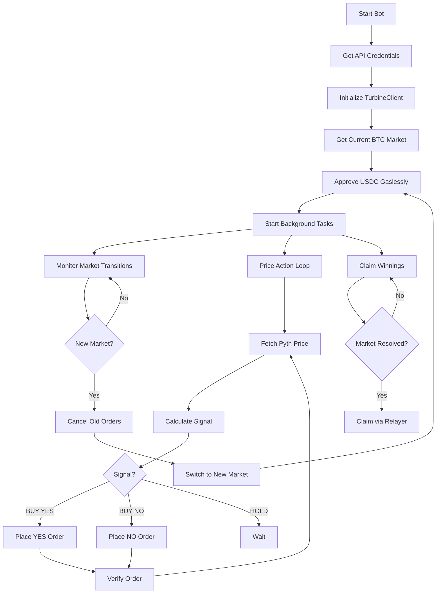

The **Price Action Bot** is the canonical reference implementation for Turbine trading bots. It demonstrates every aspect of the bot lifecycle in 787 lines of production-ready Python.

<Info>
  **This is the recommended starting point** for anyone building a Turbine bot. Every other bot follows this structure — only the trading signal logic changes.
</Info>

[View source on GitHub →](https://github.com/ojo-network/turbine-py-client/blob/main/examples/price_action_bot.py)

## What It Does

The Price Action Bot trades BTC 15-minute prediction markets using real-time price data from **Pyth Network** — the same oracle Turbine uses to resolve markets.

### Trading Strategy

1. Fetch the live BTC price from Pyth Network
2. Compare it to the market's strike price
3. Make a trading decision:
   - If **price > strike** → buy YES (bet it stays above)
   - If **price < strike** → buy NO (bet it drops below)
   - If **price ≈ strike** → HOLD (not confident)
4. Confidence scales with distance from strike
5. Place limit orders at a price derived from confidence

### Why This Strategy Works

**Oracle alignment.** The bot's trading signal comes from the same data source (Pyth) that determines winners. When BTC is $500 above the strike with 2 minutes left, Pyth data says "YES is winning" — and that's exactly what the bot trades on.

This is the simplest and most intuitive strategy for newcomers.

## Architecture

### High-Level Flow



### File Structure

The bot is organized into clear sections:

| Lines | Section | Purpose |
|-------|---------|--------|
| 1-82 | **Configuration** | Imports, environment variables, constants |
| 84-137 | **Credential Management** | API credential registration and `.env` saving |
| 139-155 | **Asset State** | Per-asset trading state (markets, positions, orders) |
| 157-276 | **Bot Initialization** | Constructor, USDC approval, HTTP client |
| 278-340 | **Position Tracking** | Cleanup pending orders, sync positions |
| 341-373 | **Pyth Price Fetching** | Async HTTP calls to Pyth Network |
| 375-418 | **Signal Calculation** | Core strategy: price vs strike → BUY_YES/BUY_NO/HOLD |
| 419-587 | **Order Execution** | Create, submit, and verify orders |
| 588-643 | **Price Action Loop** | Main loop: fetch prices → calculate signal → trade |
| 644-710 | **Order Management** | Cancel orders (all or per-asset) |
| 711-792 | **Market Lifecycle** | Market transitions, monitoring, claiming |
| 844-876 | **Main Entry Point** | Parse args, create client, run bot |

## Key Components

### 1. Credential Management

The bot needs two types of credentials:

1. **Wallet private key** (for signing orders)
2. **API credentials** (for authenticated API calls)

API credentials are automatically registered on first run:

```python
def get_or_create_api_credentials(env_path: Path = None):
    """Get existing credentials or register new ones and save to .env."""
    api_key_id = os.environ.get("TURBINE_API_KEY_ID")
    api_private_key = os.environ.get("TURBINE_API_PRIVATE_KEY")

    if api_key_id and api_private_key:
        return api_key_id, api_private_key

    # Register new credentials by signing a message with wallet
    credentials = TurbineClient.request_api_credentials(
        host=TURBINE_HOST,
        private_key=private_key,
    )

    # Auto-save to .env
    _save_credentials_to_env(env_path, credentials["api_key_id"], credentials["api_private_key"])
    return credentials["api_key_id"], credentials["api_private_key"]
```

**Key insight:** The user only needs to provide `TURBINE_PRIVATE_KEY` in `.env`. Everything else is automatic.

### 2. Per-Asset State

The bot can trade multiple assets (BTC, ETH, SOL) simultaneously. Each asset gets its own state:

```python
class AssetState:
    """Per-asset trading state."""
    def __init__(self, asset: str):
        self.asset = asset
        self.market_id: str | None = None
        self.settlement_address: str | None = None
        self.contract_address: str | None = None
        self.strike_price: int = 0  # Price when market created
        self.position_usdc: dict[str, float] = {}  # market_id -> usdc spent
        self.active_orders: dict[str, str] = {}  # order_hash -> BUY_YES/BUY_NO
        self.processed_trade_ids: set[int] = set()
        self.pending_order_txs: set[str] = set()
        self.traded_markets: dict[str, str] = {}  # For claiming winnings
        self.market_expiring = False
        self.last_signal: str | None = None
```

This allows the bot to:
- Track positions per asset independently
- Avoid double-counting filled orders
- Know which markets to claim from
- Handle market expiration per asset

### 3. Gasless USDC Approval

**Critical infrastructure pattern.** Before trading, the bot must approve the settlement contract to spend USDC.

Turbine uses a **gasless EIP-2612 permit** via the relayer — no native gas tokens (ETH, MATIC) required.

```python
def ensure_settlement_approved(self, settlement_address: str) -> None:
    """Ensure USDC is approved for the settlement contract."""
    # Check if already approved in this session
    if settlement_address in self.approved_settlements:
        return

    # Check on-chain allowance via API
    current_allowance = self.client.get_usdc_allowance(spender=settlement_address)
    if current_allowance >= self.MAX_APPROVAL_THRESHOLD:  # Half of max uint256
        self.approved_settlements[settlement_address] = current_allowance
        return

    # Submit gasless max permit via API
    result = self.client.approve_usdc_for_settlement(settlement_address)
    tx_hash = result.get("tx_hash")  # Returns dict, not raw string

    # Wait for confirmation by polling allowance
    for _ in range(30):
        allowance = self.client.get_usdc_allowance(spender=settlement_address)
        if allowance >= self.MAX_APPROVAL_THRESHOLD:
            print(f"Max USDC approval confirmed (gasless)")
            self.approved_settlements[settlement_address] = allowance
            break
        time.sleep(2)
```

**Key details:**
- One-time max approval per settlement contract (not per market, not per order)
- Submitted via API, not direct RPC
- Returns a dict with `tx_hash`, not a raw transaction hash
- Check allowance first to avoid redundant approvals

### 4. Price Fetching (Pyth Network)

The bot fetches prices from Pyth Network's Hermes API in a single async request for all assets:

```python
async def get_current_prices(self) -> dict[str, float]:
    """Fetch current prices for all active assets from Pyth Network."""
    http_client = await self._get_http_client()
    feed_ids = [PYTH_FEED_IDS[asset] for asset in self.assets]
    
    response = await http_client.get(
        PYTH_HERMES_URL,
        params=[("ids[]", fid) for fid in feed_ids],
    )
    data = response.json()

    prices: dict[str, float] = {}
    for parsed in data["parsed"]:
        feed_id = "0x" + parsed["id"]
        asset = feed_to_asset.get(feed_id)
        if asset:
            price_data = parsed["price"]
            price_int = int(price_data["price"])
            expo = price_data["expo"]
            prices[asset] = price_int * (10 ** expo)  # Convert to USD

    return prices
```

**Why Pyth?**
- Same oracle Turbine uses to resolve markets
- Real-time, low-latency data (updated every 400ms)
- Free public API (no auth required)

### 5. Signal Calculation (Core Strategy)

This is the **only part that changes** between different bot strategies. Everything else is infrastructure.

```python
async def calculate_signal(self, state: AssetState, current_price: float) -> tuple[str, float]:
    """Calculate trading signal based on current price vs strike.
    
    Returns:
        (action, confidence) where action is BUY_YES/BUY_NO/HOLD
    """
    strike_usd = state.strike_price / 1e6
    price_diff_pct = ((current_price - strike_usd) / strike_usd) * 100
    
    # Threshold: 0.1% (10 bps)
    if abs(price_diff_pct) < 0.1:
        return "HOLD", 0.0
    
    # Confidence scales with distance from strike
    raw_confidence = min(abs(price_diff_pct) / 2, 0.9)  # Cap at 90%
    confidence = max(raw_confidence, 0.6)  # Floor at 60%
    
    if price_diff_pct > 0:
        return "BUY_YES", confidence
    else:
        return "BUY_NO", confidence
```

**Example:**
- Strike: $97,250
- Current: $97,750 (+0.51%)
- Signal: `BUY_YES` with 60% confidence
- Action: Place a YES limit order at ~58% (below fair value for edge)

### 6. Order Execution

**Critical infrastructure pattern.** After submitting an order, the bot must verify its state:

```python
async def execute_signal(self, state: AssetState, action: str, confidence: float):
    # Create and submit order
    order = self.client.create_limit_buy(
        market_id=state.market_id,
        outcome=outcome,
        price=price,
        size=shares,
        expiration=int(time.time()) + 600,
        settlement_address=state.settlement_address,
    )
    result = self.client.post_order(order)
    
    # Wait 2 seconds for settlement
    await asyncio.sleep(2)
    
    # === ORDER VERIFICATION CHAIN ===
    # 1. Check for failures
    failed_trades = self.client.get_failed_trades()
    if my_order_failed:
        print(f"Order FAILED: {reason}")
        return
    
    # 2. Check for pending on-chain
    pending_trades = self.client.get_pending_trades()
    if my_order_pending:
        state.pending_order_txs.add(tx_hash)
        return
    
    # 3. Check if immediately filled
    recent_trades = self.client.get_trades(market_id=state.market_id, limit=20)
    if my_order_filled:
        # Update position tracking
        usdc_spent = (trade.size * trade.price) / (1_000_000 * 1_000_000)
        state.position_usdc[state.market_id] += usdc_spent
        return
    
    # 4. Check if resting on orderbook
    open_orders = self.client.get_orders(trader=self.client.address, market_id=state.market_id)
    if my_order_open:
        state.active_orders[order_hash] = action
```

**Why this matters:** Without verification, the bot doesn't know if orders failed, filled, or are still open. This causes double-spends, missed fills, and incorrect position tracking.

### 7. Market Rotation

Every 15 minutes, a new market opens. The bot must detect this and transition:

```python
async def monitor_market_transitions(self):
    """Background task that polls for new markets every 5 seconds."""
    while self.running:
        for asset in self.assets:
            market_info = await self.get_active_market(asset)
            new_market_id, end_time, start_price = market_info
            
            if new_market_id != state.market_id:
                # Switch to new market
                await self.switch_to_new_market(state, new_market_id, start_price)
            
            # Stop trading when <60s remain
            time_remaining = end_time - int(time.time())
            if time_remaining <= 60:
                state.market_expiring = True
        
        await asyncio.sleep(5)
```

```python
async def switch_to_new_market(self, state: AssetState, new_market_id: str, start_price: int):
    """Switch to a new market and reset state."""
    # Track old market for claiming
    if state.market_id and state.contract_address:
        state.traded_markets[state.market_id] = state.contract_address
    
    # Cancel all orders on old market
    await self.cancel_asset_orders(state)
    
    # Update to new market
    state.market_id = new_market_id
    state.strike_price = start_price
    state.active_orders.clear()
    state.market_expiring = False
    
    # Fetch settlement address and approve USDC
    state.settlement_address = fetch_settlement_address(new_market_id)
    self.ensure_settlement_approved(state.settlement_address)
```

**Key insight:** The bot must cancel old orders before trading the new market, otherwise orders linger on expired markets.

### 8. Claiming Winnings

Background task that checks for resolved markets and claims via the gasless relayer:

```python
async def claim_resolved_markets(self):
    """Background task to claim winnings every 120 seconds."""
    while self.running:
        # Collect all traded markets across all assets
        all_traded = []
        for state in self.asset_states.values():
            for market_id, contract_address in state.traded_markets.items():
                all_traded.append((market_id, contract_address, state))
        
        # Check which are resolved
        resolved = []
        for market_id, contract_address, state in all_traded:
            resolution = self.client.get_resolution(market_id)
            if resolution and resolution.resolved:
                resolved.append((market_id, contract_address, state))
        
        if resolved:
            # Batch claim in one transaction
            market_addresses = [addr for _, addr, _ in resolved]
            result = self.client.batch_claim_winnings(market_addresses)
            tx_hash = result.get("txHash", result.get("tx_hash"))
            print(f"Claimed {len(resolved)} markets TX: {tx_hash}")
            
            # Remove claimed markets from tracking
            for market_id, _, state in resolved:
                del state.traded_markets[market_id]
        
        await asyncio.sleep(120)
```

**Key details:**
- Batch claiming is more gas-efficient than claiming individually
- Enforces 120-second delay (API rate limit is 15 seconds, but less frequent is fine)
- Removes claimed markets from tracking to avoid re-claiming

## Position Tracking

The bot tracks positions in **USDC spent**, not shares held. This simplifies limit checks:

```python
def get_position_usdc(self, state: AssetState, market_id: str) -> float:
    """Get current position in USDC for a market."""
    return state.position_usdc.get(market_id, 0.0)

def can_trade(self, state: AssetState, usdc_amount: float) -> bool:
    """Check if trade would exceed max position."""
    current = self.get_position_usdc(state, state.market_id)
    return (current + usdc_amount) <= self.max_position_usdc
```

When an order fills, increment the position:

```python
usdc_spent = (trade.size * trade.price) / (1_000_000 * 1_000_000)
state.position_usdc[state.market_id] += usdc_spent
```

**Why USDC instead of shares?**
- Simpler risk management ("don't spend more than $10 per market")
- No need to track YES vs NO separately
- Easy to calculate from fills: `size * price`

## Configuration

### Command-Line Arguments

```bash
python examples/price_action_bot.py \
  --order-size 5 \        # $5 per order
  --max-position 50 \     # $50 max per asset per market
  --assets BTC,ETH        # Trade BTC and ETH only
```

### Environment Variables

```bash
TURBINE_PRIVATE_KEY=0x...      # Required: wallet private key
TURBINE_API_KEY_ID=...         # Auto-generated on first run
TURBINE_API_PRIVATE_KEY=...    # Auto-generated on first run
CHAIN_ID=137                   # 137 = Polygon mainnet
TURBINE_HOST=https://api.turbinefi.com
CLAIM_ONLY_MODE=false          # Set to true to disable trading
```

### Tuning Parameters

You can adjust these constants to change bot behavior:

```python
# Order sizing
DEFAULT_ORDER_SIZE_USDC = 1.0   # $1 per order
DEFAULT_MAX_POSITION_USDC = 10.0  # $10 max per asset

# Signal sensitivity
PRICE_THRESHOLD_BPS = 10   # 0.1% threshold before taking action
MIN_CONFIDENCE = 0.6       # Minimum confidence to trade
MAX_CONFIDENCE = 0.9       # Cap confidence at 90%

# Timing
PRICE_POLL_SECONDS = 10    # How often to check prices
```

## Running the Bot

### Local Development

```bash
# Setup
git clone https://github.com/ojo-network/turbine-py-client.git
cd turbine-py-client
python3 -m venv .venv && source .venv/bin/activate
pip install -e .

# Configure
echo 'TURBINE_PRIVATE_KEY=0x...' > .env
echo 'CHAIN_ID=137' >> .env
echo 'TURBINE_HOST=https://api.turbinefi.com' >> .env

# Run
python examples/price_action_bot.py
```

### Production Deployment

For 24/7 operation, deploy to a cloud provider:

<CardGroup cols={2}>
  <Card title="Railway" icon="train">
    Use the `/railway-deploy` skill for one-command deployment.
    
    Free $5 credit (runs ~30 days).
  </Card>
  
  <Card title="Other Providers" icon="cloud">
    AWS, GCP, Azure, DigitalOcean, Heroku, etc.
    
    Any Python-compatible host works.
  </Card>
</CardGroup>

## Customizing the Strategy

To build your own trading algorithm:

<Steps>
  <Step title="Copy the reference">
    ```bash
    cp examples/price_action_bot.py examples/my_custom_bot.py
    ```
  </Step>
  
  <Step title="Replace the signal logic">
    Find the `calculate_signal()` function (lines 375-418) and replace with your algorithm.
    
    Keep the return signature: `(action: str, confidence: float)`
  </Step>
  
  <Step title="Keep infrastructure intact">
    Do NOT modify:
    - Credential management
    - USDC approval
    - Order verification chain
    - Market rotation
    - Claiming winnings
  </Step>
  
  <Step title="Test locally">
    ```bash
    python examples/my_custom_bot.py --order-size 0.5 --max-position 5
    ```
    
    Start with small amounts to validate your logic.
  </Step>
</Steps>

### Example: Momentum Strategy

Replace `calculate_signal()` with momentum detection:

```python
async def calculate_signal(self, state: AssetState, current_price: float) -> tuple[str, float]:
    """Buy when price is moving strongly in one direction."""
    # Track last 10 prices
    state.price_history.append(current_price)
    if len(state.price_history) < 10:
        return "HOLD", 0.0
    
    # Calculate velocity
    recent = state.price_history[-5:]
    velocity = (recent[-1] - recent[0]) / recent[0]
    
    # Strong upward momentum
    if velocity > 0.005:  # 0.5% in 50 seconds
        return "BUY_YES", 0.7
    
    # Strong downward momentum
    if velocity < -0.005:
        return "BUY_NO", 0.7
    
    return "HOLD", 0.0
```

Everything else stays the same.

## Performance Optimization

### Reduce API Calls

**Problem:** The bot makes many API calls per cycle (orderbook, trades, pending, failed).

**Solution:** Batch related calls together, cache orderbook data:

```python
# Bad: 4 separate calls
failed = client.get_failed_trades()
pending = client.get_pending_trades()
trades = client.get_trades(market_id)
orders = client.get_orders(trader=address)

# Better: Use WebSocket for real-time updates
ws_client.subscribe_orderbook(market_id, callback=on_orderbook_update)
ws_client.subscribe_trades(market_id, callback=on_trade)
```

### Faster Price Polling

Reduce `PRICE_POLL_SECONDS` from 10 to 2-5 seconds for more responsive trading:

```python
PRICE_POLL_SECONDS = 2  # Check Pyth every 2 seconds
```

**Trade-off:** More API calls to Pyth (but Pyth is free and has no rate limits).

### Parallel Asset Trading

The bot already trades multiple assets in parallel using per-asset state. To add more assets:

```bash
python examples/price_action_bot.py --assets BTC,ETH,SOL
```

Each asset:
- Fetches prices in one batch request
- Executes trades independently
- Tracks positions separately

## Troubleshooting

<AccordionGroup>
  <Accordion title="Order rejected: 'simulation failed'">
    **Cause:** Insufficient USDC balance or allowance.
    
    **Fix:**
    1. Check balance: `client.get_usdc_balance()`
    2. Verify allowance: `client.get_usdc_allowance(spender=settlement_address)`
    3. If allowance is low, re-run approval: `client.approve_usdc_for_settlement(settlement_address)`
  </Accordion>
  
  <Accordion title="Bot keeps trading the old market after rotation">
    **Cause:** Market monitor task not running or `switch_to_new_market()` not called.
    
    **Fix:**
    1. Check `monitor_market_transitions()` is running in background
    2. Ensure orders are cancelled before switching: `await self.cancel_asset_orders(state)`
    3. Verify new market ID is updated: `state.market_id = new_market_id`
  </Accordion>
  
  <Accordion title="Fills not tracked correctly (double-counting)">
    **Cause:** Not using `processed_trade_ids` to deduplicate.
    
    **Fix:**
    ```python
    for trade in recent_trades:
        if trade.id in state.processed_trade_ids:
            continue  # Already processed
        state.processed_trade_ids.add(trade.id)
        # ... update position
    ```
  </Accordion>
  
  <Accordion title="'No claimable positions found' error">
    **Cause:** This is normal — means no markets have resolved yet.
    
    **Fix:** Ignore this error. It's expected when checking for claims on a schedule.
  </Accordion>
</AccordionGroup>

## Next Steps

<CardGroup cols={2}>
  <Card title="Market Maker Bot" icon="arrows-left-right" href="/examples/market-maker">
    Study the advanced strategy with statistical pricing and inventory management.
  </Card>
  
  <Card title="Position Monitoring" icon="chart-pie" href="/examples/position-monitoring">
    Learn how to track positions and calculate P&L.
  </Card>
  
  <Card title="API Reference" icon="code" href="/api/client">
    Explore all available SDK methods.
  </Card>
  
  <Card title="Deploy to Railway" icon="train" href="/deployment/railway">
    Run your bot 24/7 in the cloud.
  </Card>
</CardGroup>